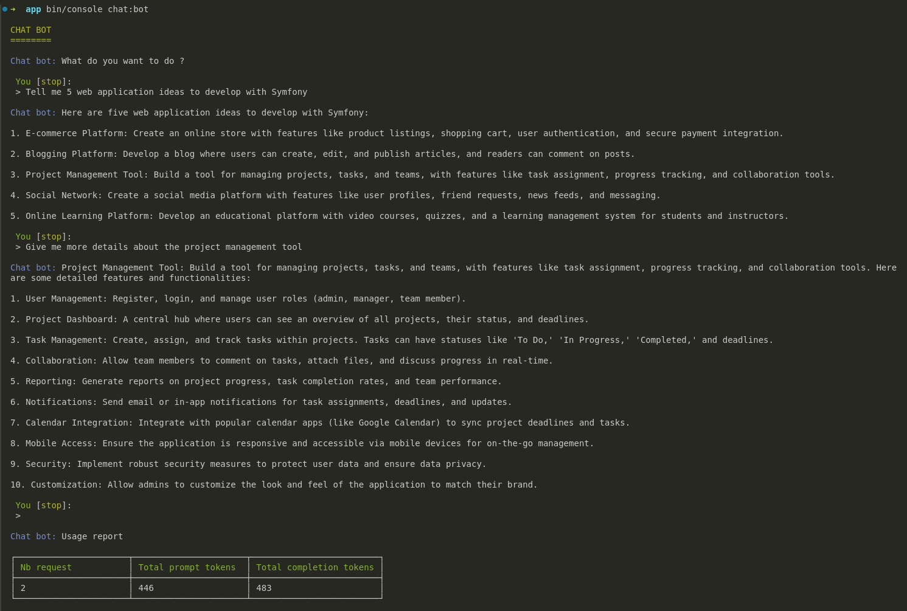

# Example 1 : basic chat bot

## Purpose :
Our goal is to create a chatbot using the `ConsoleToolAgent`, even though it is not its primary purpose.

## Implementation :

**Step 1 :** create `ChatBotCommand`
```php
<?php

namespace App\Command;

use ArnaudDelgerie\AiToolAgent\Util\AgentIO;
use Symfony\Component\Console\Command\Command;
use ArnaudDelgerie\AiToolAgent\Enum\ClientEnum;
use Symfony\Component\Console\Style\SymfonyStyle;
use Symfony\Component\Console\Attribute\AsCommand;
use Symfony\Component\Console\Input\InputInterface;
use Symfony\Component\Console\Output\OutputInterface;
use ArnaudDelgerie\AiToolAgent\Util\ToolAgentProvider;
use ArnaudDelgerie\AiToolAgent\Util\Config\AgentConfig;
use ArnaudDelgerie\AiToolAgent\Util\Config\ClientConfig;
use ArnaudDelgerie\AiToolAgent\ToolFunctionManager\ConsoleChatWithUserToolFunctionManager;

#[AsCommand(name: 'chat:bot')]
class ChatBotCommand extends Command
{
    public function __construct(private ToolAgentProvider $toolAgentProvider)
    {
        parent::__construct();
    }

    protected function execute(InputInterface $input, OutputInterface $output): int
    {
        $io = new SymfonyStyle($input, $output);
        $io->title('CHAT BOT');

        // API key for authentication (ensure secure handling in production)
        $apiKey = 'Your client API key (OpenAI, Mistral, or Anthropic)';

        // Configure the AI client with model selection
        $clientConfig = new ClientConfig(ClientEnum::Mistral, $apiKey, 'codestral-latest');

        // Define system prompt and functions
        $systemPrompt = 'You are a helpful web developer assistant';
        
        // ConsoleChatWithUserToolFunctionManager is provided by the bundle
        $functionNames = [ConsoleChatWithUserToolFunctionManager::getName()];
        $agentConfig = new AgentConfig($systemPrompt, $functionNames);

        // Initialize the console tool agent
        $consoleToolAgent = $this->toolAgentProvider->createConsoleToolAgent($clientConfig, $agentConfig);
        
        // Enable usage logging if needed (logs usage report for every request)
        // $consoleToolAgent->setUsageLog(true);

        // Initialize agent I/O for user interaction
        $agentIo = new AgentIO($io, 'Chat bot');
        
        // Prompt the user for input
        $userPrompt = $agentIo->ask('What do you want to do?', 'stop');
        
        // Exit if the user types 'stop'
        if ('stop' === $userPrompt) {
            return Command::SUCCESS;
        }

        // Process the user input and run the chatbot
        $response = $consoleToolAgent->addUserMessage($userPrompt)->run($agentIo);

        // Log API usage
        $agentIo->logUsage($response->usageReport);

        return Command::SUCCESS;
    }
}
```

## Demo :
